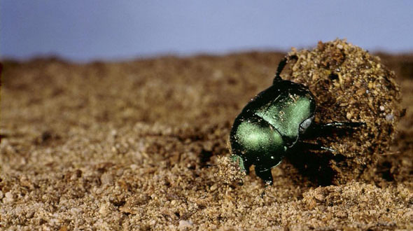

```{r setup, include=FALSE}
knitr::opts_chunk$set(echo = FALSE)
```

## Making a slide show

Two hashtags makes a new slide.

When you click the **Knit** button a document will be generated that includes both content as well as the output of any embedded R code chunks within the document.

You will want to set up a project folder for you slideshow, adding in scripts, images, etc.

## The YAML is your 1st slide, you can customize it!

output:
 ioslides_presentation:

    css: wtc_custom.css
    
    logo: img/hielogo.png
    
    smaller: yes
    
    transition: faster
    
    widescreen: yes

If you do not want to include author/date just delete it or use ""

## Slide with Bullets


- You can run the slideshow 'live' from you computer once you knit

- You can click on "open in browser" to view it as a web presentation 

- You can publish it to Rpubs for free

- You can use the rendered html file anytime/anywhere (if show is static)

## Use HTML tags to space text objects 

<br />
<br />

- You can run the slideshow 'live' from you computer once you knit

<br />

- You can click on "open in browser" to view it as a web presentation 

## Slide with animated bullets

<br />
<br />

>  - There are a quite a few good websites to help you learn the basics

> - There is a rstudio cheatsheat that you should print out for basic commands
    + https://www.rstudio.com/wp-content/uploads/2015/02/rmarkdown-cheatsheet.pdf

> - http://rmarkdown.rstudio.com/ioslides_presentation_format.html


## Easily insert images (1)


<br />

You just need to know the filepath to your image

## Easily insert images (2)

You have some control of image placement, but not much
<br />
<br />
<center></center>

## Better image placement with CSS


## Basic text control is pretty easy 

* <strong>You can use markdown language or HTML tags</strong>
  + I study how elevated CO<sub>2</sub> impacts the physiology of *Cephalodesmius armiger*
  + My research is **AWESOME**!!



## Seperate the slide titles from the body
<hr>

<br />
<br />
For that just use the horizontal rule HTML tag


## Inserting plots (1) Ive already made it
<hr>


## Inserting plots (2) Use code chunks
<hr>

```{r iris, echo = FALSE, message=FALSE, warning=FALSE}
library(scales)

palette(c(alpha("gold", .6), alpha("skyblue", .6), alpha("firebrick1", .6)))

par(mar=c(5,5,2,1),cex.axis=1, cex.lab=1.25,las=0,mgp=c(3,1,0))   

plot(Sepal.Length ~ Petal.Length, data=iris, bg=Species, pch=21, xlim=c(0,9),
     ylim=c(0,9), cex=2, ylab="Sepal Length (mm)", xlab= "Petal Length (mm)")

legend("bottomright", legend = unique(iris$Species), pt.bg=palette(), pch=21, inset = .02, cex=1)

```

## Inserting plots (3) Source scripts
<hr>

```{r iris2, echo = FALSE, message=FALSE, warning=FALSE}
library(scales)

source("iris_data.R")

```

## Tables can be done too! 
<hr>

```{R iristable, echo=FALSE, message=FALSE, warning=FALSE}
library(doBy)
iris_dat <- summaryBy(. ~ Species, data=iris, FUN=mean, keep.names = TRUE)
  
library(knitr)
kable(iris_dat, format = "html", table.attr='class="table table-hover"')

```

<br />


## xtable examples

```{r xtable, results="asis"}
n <- 100
x <- rnorm(n)
y <- 2*x + rnorm(n)
out <- lm(y ~ x)
library(xtable)
tab <- xtable(summary(out)$coef, digits=c(0, 2, 2, 1, 2))
print(tab, type="html")
```

<br />
<br />

There are several packages to make tables, they each allow different levels of customization
